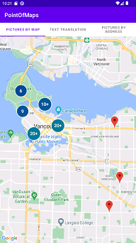
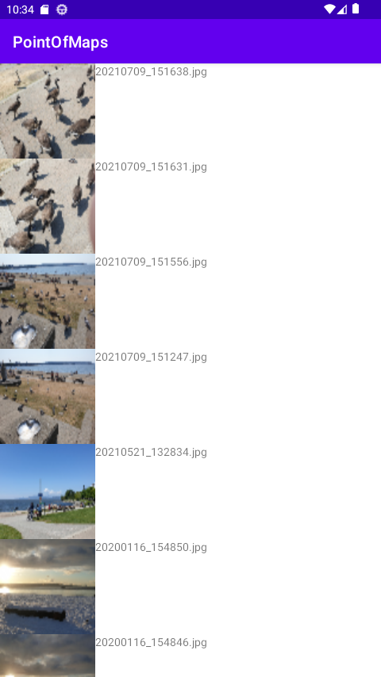
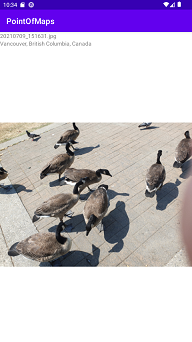

# PointOfMaps Application
## Introduce app
This app uses the Exif Interface to extract latitude and longitude values from photos containing location information, and uses this value to display the location where the photo was taken by Google Maps.

    

## Purpose 
Created an app with the purpose of improving the convenience of photo management by using the location information of photos.

## Specific SDK / Library / function list
- Google Map API
- ExifInterface
- Retrofit
- Kotlin Coroutines
- Glide
- Room
- MVVM architecture